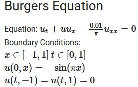

# PINNs-TF2.4.0
The notebook contains implementation in Tensorflow **2.4.0** of the Burger's Equation example put together by *Raissi et al.* in their original publication about Physics Informed Neural Networks (PINNs)  

  
The code uses a custom loss function that accounts for the physics as well apart from minimizing the error between predicted and training data. Mini-Batch Gradient Descent is adopted along with Adam optimizer (contrary to LBFGS used in the original paper).  
Link to the original publication : [https://maziarraissi.github.io/PINNs/](https://maziarraissi.github.io/PINNs/)
